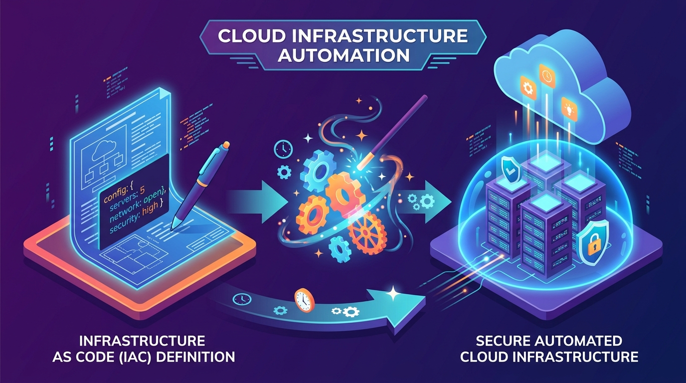



  

# 🏗️ Automated Cloud Builder (Terraform Infrastructure)

## 📌 The Business Challenge
Historically, when a company needed a new server for a website, an IT technician had to manually order the hardware, plug it in, and spend days configuring it. Even in the modern Cloud era, engineers often spend hours clicking through web menus to set up networks, which is slow and prone to human error.

## 💡 The Solution
I implemented **Infrastructure as Code (IaC)**. Instead of manually clicking buttons to build digital infrastructure, I wrote code that acts as a blueprint. 

When this code is executed, it automatically contacts the Cloud provider (like AWS) and builds the entire company network—servers, firewalls, and databases—in a matter of seconds.

## 🚀 How It Works (In Plain English)
1. **The Blueprint:** I write a configuration file stating exactly what the business needs (e.g., "We need 3 secure web servers and 1 database").
2. **The Automation (Terraform):** The tool reads my blueprint and checks what currently exists in the cloud.
3. **The Deployment:** It automatically creates, updates, or deletes the cloud resources to perfectly match the blueprint, with zero human intervention.

## 🛠️ Technology Used
*   **Terraform:** The industry-standard tool for automating cloud infrastructure.
*   **AWS (Amazon Web Services):** The global cloud platform where the digital infrastructure is actually hosted.
*   **Security Groups & Networking:** Writing strict digital firewall rules to ensure hackers cannot access the company's data.

## 📊 Business Value Delivered
*   **Massive Time Savings:** Turns a 3-day server setup process into a 3-minute automated script.
*   **Eliminates Human Error:** Because the infrastructure is written as code, it is identical and perfect every single time it is deployed.
*   **Disaster Recovery:** If the entire company network goes down, this code can rebuild it from scratch instantly.

---
*Created by [Iman Moradi Nezhad](https://github.com/ImanMrd) | Showcasing DevOps, Automation, and Cloud Engineering.*
